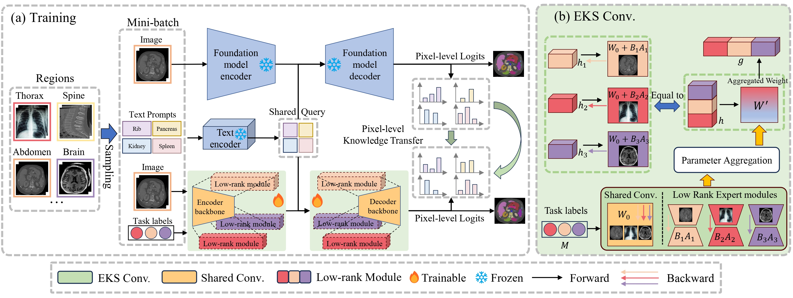

# LoRKD
This is the official repository for "LoRKD: Low-Rank Knowledge Decomposition for Medical Foundation Models", including our code for segmentation tasks. Please refer to [LoRKD](https://github.com/MediaBrain-SJTU/LoRKD) for the code for classification tasks.

The conference version of our paper can be found in CVPR [version](https://openaccess.thecvf.com/content/CVPR2024/html/Zhou_Low-Rank_Knowledge_Decomposition_for_Medical_Foundation_Models_CVPR_2024_paper.html).



[ArXiv](https://arxiv.org/abs/2404.17184)

In segmentation tasks, we decompose the foundation models [SAT](https://github.com/zhaoziheng/SAT) into lighter yet stronger expert models. The dataset can be found in [SAT-DS](https://github.com/zhaoziheng/SAT-DS/tree/main).


## Requirements
The implementation of U-Net relies on a customized version of [dynamic-network-architectures](https://github.com/MIC-DKFZ/dynamic-network-architectures), to install it:
```
cd model
pip install -e dynamic-network-architectures-main
```

Some other key requirements:
```
torch>=1.10.0
numpy==1.21.5
monai==1.1.0 
transformers==4.21.3
nibabel==4.0.2
einops==0.6.1
positional_encodings==6.0.1
```

Our environment are provided in lorkd.yaml (conda) and requirements.txt (pip).

## Inference Guidance:
- S1. Build the environment following the requirements.

- S2. Download checkpoint of LoRKD and Text Encoder from [Google Drive](https://drive.google.com/drive/folders/1VJFXGf-bdYuDwKI5xDKtlEi-uQT3GTO3?usp=share_link). Download the [BioLORD](https://huggingface.co/FremyCompany/BioLORD-2023-C) checkpoint for the Text Encoder.

- S3. Prepare the data to inference in a jsonl file. A demo can be found in `data/inference_demo/demo.jsonl`. Make sure the image path, label name and modality are correctly filled in. `image`(path to image), `label`(name of segmentation targets), `dataset`(which dataset the sample belongs to) and `modality`(ct, mri or pet) are needed for each sample to segment. 
The input image should be with shape `H,W,D` Our data process code will normalize the input image in terms of orientation, intensity, spacing and so on. Make sure the normalization is done correctly to guarantee the performance of the model.

- S4. Start the inference. Please uses the two sample scripts in sbatch_script, which correspond to the LoRKD-Pro and LoRKD-Nano model respectively.
    ```
    sh sbatch_script/inference_lorkd_imbalance_pro_lora.sh
    ```
    The checkpoint path
    Note that you need to change the checkpoint path to your own directory, and you can modify `--max_queries` and `--batchsize` to accelerate the inference, based on the computation resource you have.

- S5. Check the path where you store the images. For each image, a folder with the same name will be created. Inside each folder, you will find the predictions for each label (named after the label), the aggregate results for all labels (prediction.nii.gz), and the input image (image.nii.gz). You can visualize them using the [ITK-SNAP](http://www.itksnap.org/pmwiki/pmwiki.php).


## TODO
- [x] Release the inference code of LoRKD
- [x] Release the model of LoRKD
- [ ] Release the training and evaluation code of LoRKD


# Citation
If you find LoRKD useful for your research or project, please cite the following:
```
@inproceedings{zhou2024low,
  title={Low-Rank Knowledge Decomposition for Medical Foundation Models},
  author={Zhou, Yuhang and Li, Haolin and Du, Siyuan and Yao, Jiangchao and Zhang, Ya and Wang, Yanfeng},
  booktitle={Proceedings of the IEEE/CVF Conference on Computer Vision and Pattern Recognition},
  pages={11611--11620},
  year={2024}
}
```
